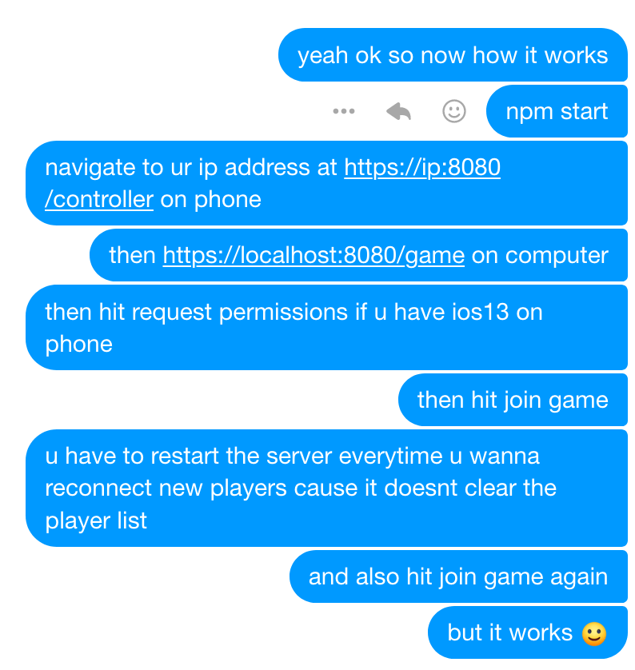

# hab

NOTE: There is now a step where you have to hit the start button so the game 
won't start until all players that want to join have joined.
Scroll up if you can't see the start button since 
I'm going back to sleep and am not making it look nice right now.

also, put the certs in the project root (key and cert pem files)
